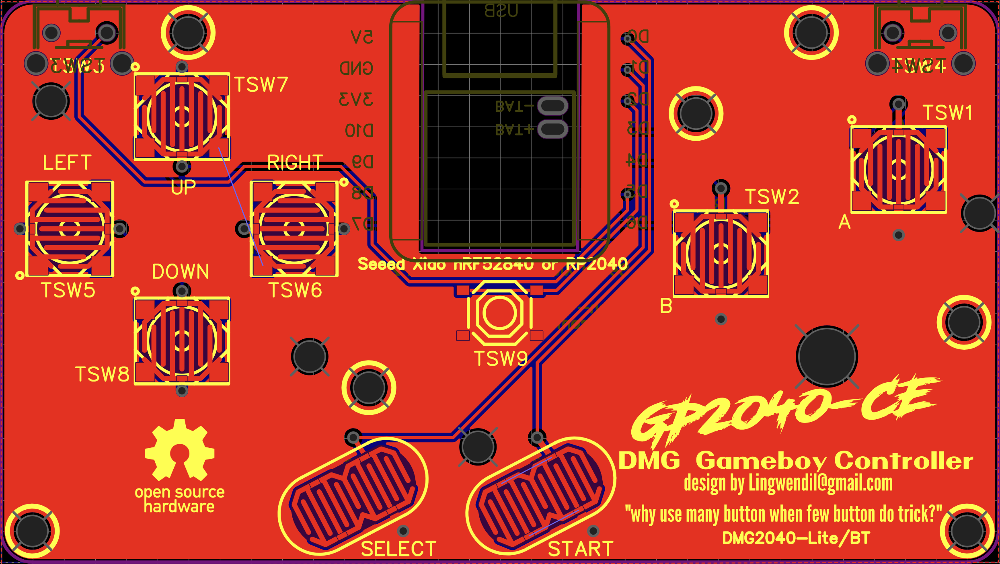
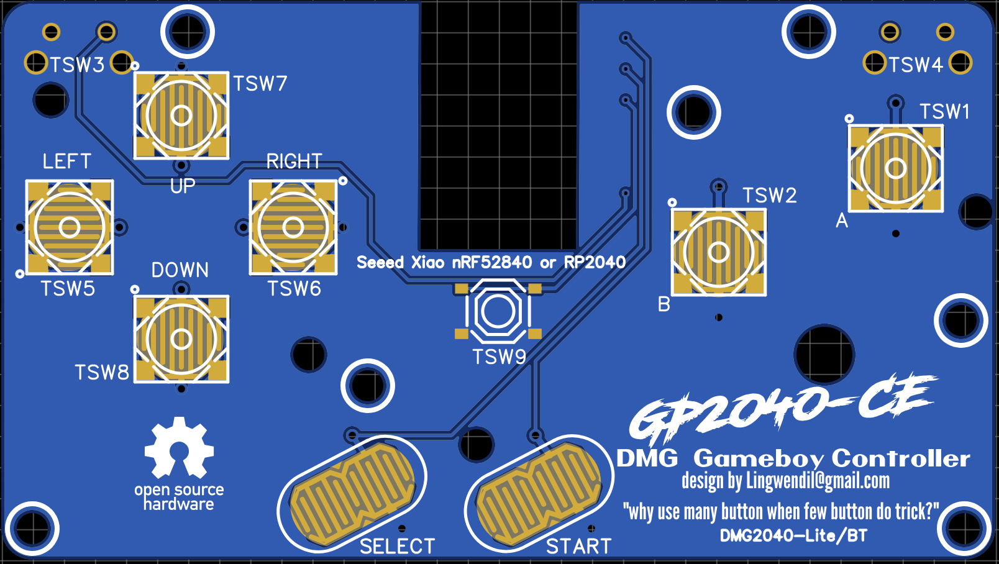
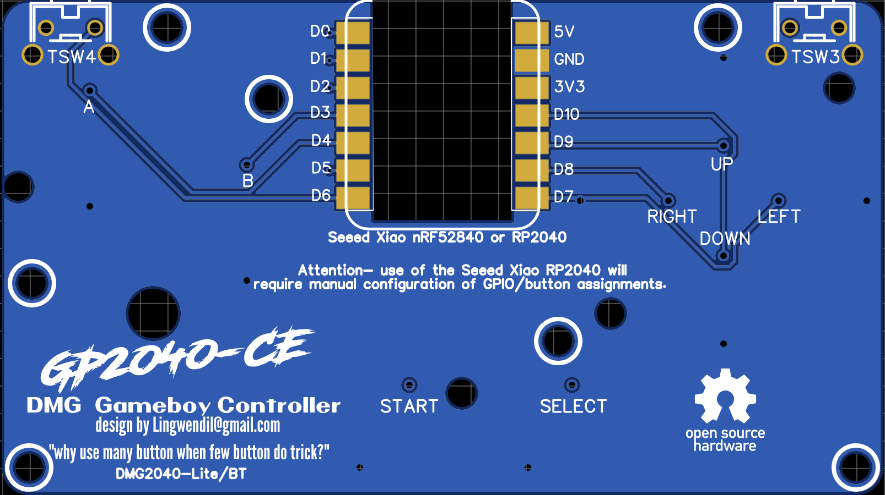

### DMG2040-Pro
The DMG2040-Pro PCB uses the popular Waveshare RP2040-zero MCU, and allows the unused GPIO pins to be accessed by standard 0.1" pitch (2.54mm) pin headers. I2C and USB could be easily accessed by GPIO 28/29 (USB) and GPIO 8/9 (I2C). This board is meant to be a versatile and potentially feature rich way to make a full featured controller that will work on many different platforms- depending on your choice of firmware, of course. Additional screw mounting holes have been added for custom shell applications.

### DMG2040-Lite
The DMG2040-Lite is a stripped down, more basic version of the PCB, with the primary intention being to use the popular Seeed Studio Xiao microcontrollers- specifically the Seeed Xiao nRF52840. 
The nRF52840 is meant to be used with the lovely slimbox-bt firmware by Jfedor, found here- https://github.com/jfedor2/slimbox-bt. The Seeed Xiao RP2040 will also fit and function perfectly on this board, and if used with the GP2040-CE firmware will simply require manual configuration of the GPIO to assign the buttons to their proper functions. Additional screw mounting holes have been added for custom shell applications.

