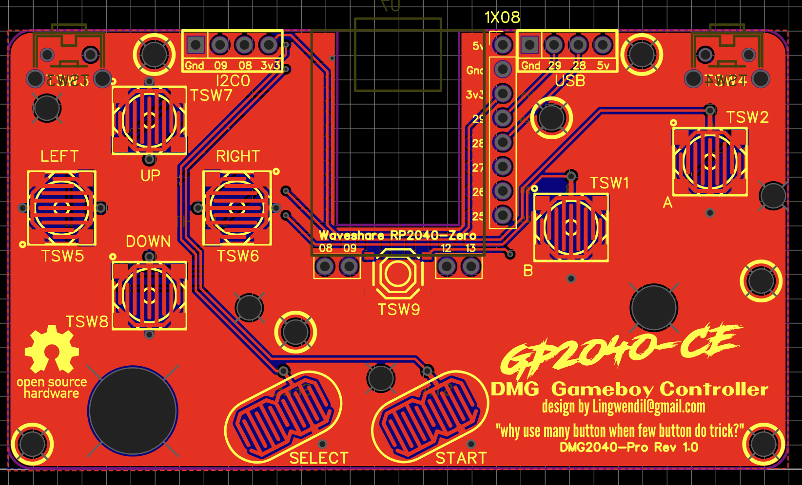
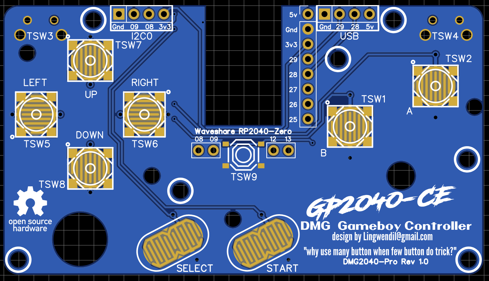
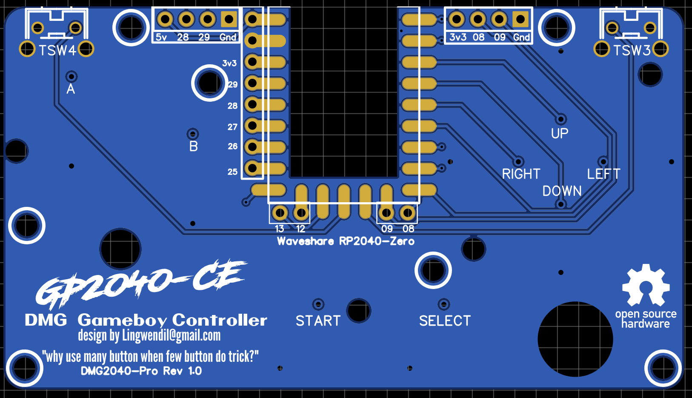
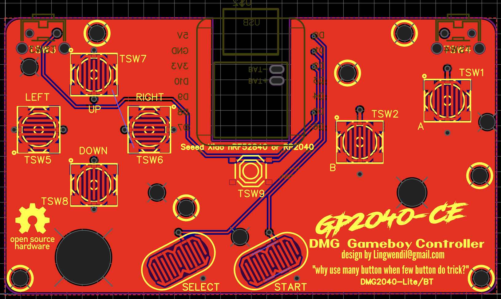
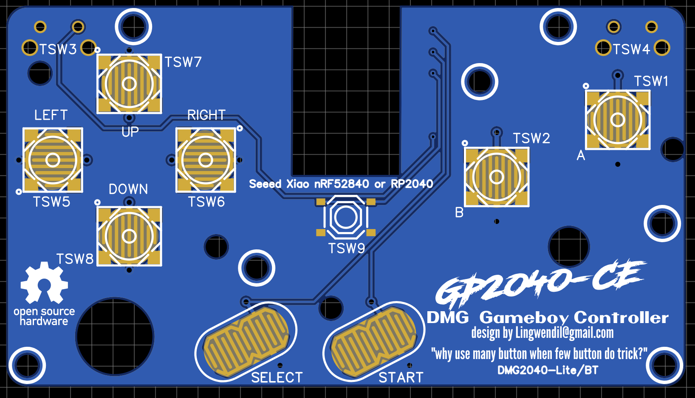
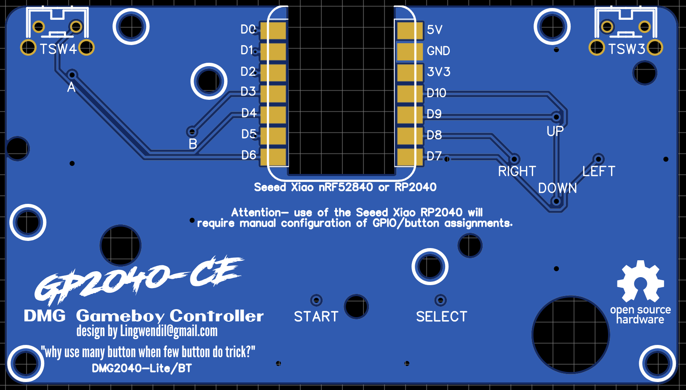

### DMG2040-Pro
The DMG2040-Pro PCB uses the popular Waveshare RP2040-zero MCU, and allows the unused GPIO pins to be accessed by standard 0.1" pitch (2.54mm) pin headers. I2C and USB could be easily accessed by GPIO 28/29 (USB) and GPIO 8/9 (I2C). This board is meant to be a versatile and potentially feature rich way to make a full featured controller that will work on many different platforms- depending on your choice of firmware, of course. Additional screw mounting holes have been added for custom shell applications. (MOST CURRENT RELEASE LIVE AS OF 04/14/2026)

### DMG2040-Lite
The DMG2040-Lite is a stripped down, more basic version of the PCB, with the primary intention being to use the popular Seeed Studio Xiao microcontrollers- specifically the Seeed Xiao nRF52840. 
The nRF52840 is meant to be used with the lovely slimbox-bt firmware by Jfedor, found here- https://github.com/jfedor2/slimbox-bt. The Seeed Xiao RP2040 will also fit and function perfectly on this board, and if used with the GP2040-CE firmware will simply require manual configuration of the GPIO to assign the buttons to their proper functions. Additional screw mounting holes have been added for custom shell applications. (RELEASE DATE TBD)

## Installation and configuration
Refer to the instructions given by your chosen firmware for detailed software installation instructions. Once the firmware has been installed It is recommended that you confirm function before soldering the microcontroller board to the Game Boy button PCB. 

-The DMG2040-Pro will work with the standard current release GP2040-CE firmware file without additional configuration for the buttons, but will require configuration via the Web Configurator utility to assign any additional function to the GPIO pins, such as I2C, USB passthrough, or additional buttons. As of this writing there is also a specific firmware build for the DMG2040 that inlcudes a custom layout for the OLED screen- `GP2040-CE_0.7.12_DMG2040-PRO.uf2` The shoulder and home buttons are by default assigned as TSW3= `B3`, TSW4= as `B4` and TSW9= `A1` using GP2040-CE nomenclature. Standard button assignment on the PCB is B1= `A`, B2= `B`, S1= `Select`, and s2= `Start`. Please keep in mind using input mode `Nintendo Switch` will swap the functions for B1/B2 and may require a custom profile to prevent this if your use case has you swapping between consoles/devices.

-The DMG2040-Lite when using the Seeed Xiao nRF52840 Microcontroller will work with the Slimbox-BT `slimbox-bt-xiao_nrf52840.uf2` firmware file without additional configuration for the buttons. The shoulder and home buttons are by default assigned as TSW3- `West`, TSW4 as `North` and TSW9 ``Home using Jfedor's slimbox-bt nomenclature. If you use the Seeed Xiao RP2040 Microcontroller with the Gp2040-CE firmware you will need to maually configure the GPIO pin assignments to line up with the chosen button configuration.
